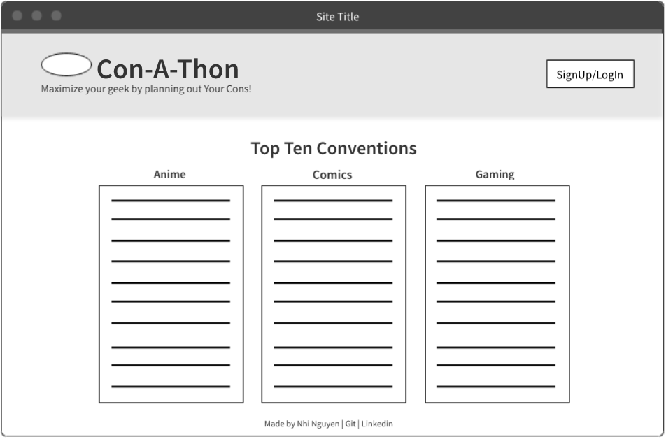

# CON-A-THON
### Nerdy Conventions Galore!

Get your geek on by planning out your year's con schedule! 

This site allows users to see a list of the top 10 anime, comic, and gaming conventions in the USA. Users can view the date and location of each convention. Each convention will have a link to the con home page so users can easily check-out more specific details. 

## User Stories
## MVP
* As a User, I want to explore the site without an account, so I don't have to sign up.
* As a User, I want to see links to other sites, so I don't have to go googling for it.
* As a User, I want to create an account, so I can save/delete the conventions I'm interested in going to.

### Bronze
* As a User, I want the option to add/edit other conventions that I might want to go to, in case it's not in the top 10.

### Silver 
* As a User, I want to see my saved cons in a calender, so I can better visualize my schedule.

### Gold
* Undecided.

## Models
  - User Sign-Up/Log-In: Username, Password (Strings)
  - Cons: Name, Date, Location, URL, genre (Strings)

## WireFrame
