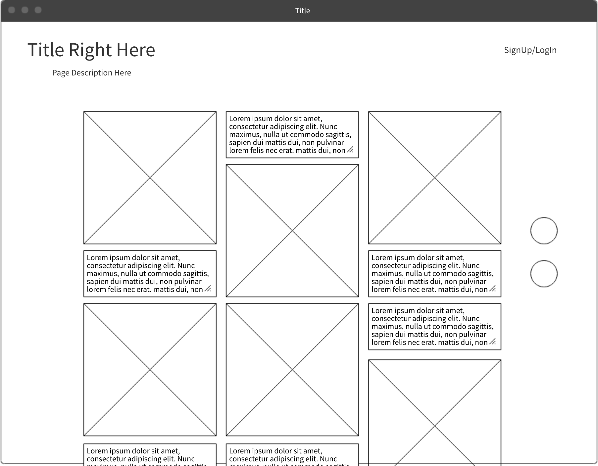

## PokeStop 
Nerdy Culture
This site allows users to see and contribute links and images of nerd culture in an Instagram-like fashion. Users will be able to save images/links they like in their profile. Images will popup with detail of that image and links (if it's referencing someplace or something) and links will direct users to those sites. 

# User Stories

# MVP
* As a User, I want to explore the site without an account, so I don't have to sign up.
* As a User, I want to see links to other sites, so I have multiple resources to explore.
* As a User, I want to see a preview/description, so that I don't have to click through everything.

# Bronze
* As a User, I want to create an account, so I can create/post/save things.
* As a User, I want to contribute links to the site, so that I can share cool nerdy things I've seen.
* As a User, I want to be able to save/'like' those cool places.

# Silver 
* As a User, I want to be able to upload images, so I can save images as well.

# Gold
* As a User, I want to be able to tag and filter through content, so I don't have to see things not relevant to my interests.

# Models
  - User Sign-Up/Log-In: Username, Password (Strings)
  - Links: Title, Image (that I uploaded), Description, URL (Strings)
  - Images (Uploads): (Same as Links but images that users upload)

# WireFrame
